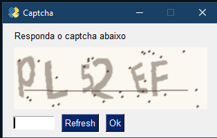

# Captcha Generator
## Gerador de Captcha



Gerador de captcha desenvolvido em Python

## Bibliotecas utilizadas

- [PySimpleGui](https://pypi.org/project/PySimpleGUI)
- [Captcha](https://pypi.org/project/captcha/)
- [Random]()

## Instalação

PySimpleGui
```sh
pip install PySimpleGUI
```
Captcha
```sh
pip install captcha
```
